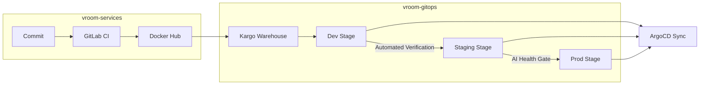

# Vroom GitOps: Multi-Stage Promotion with Kargo & ArgoCD

This repository is the central "Source of Truth" for the **Vroom** ecosystem. It manages the desired state of all environments (Dev, Staging, Prod) using a sophisticated GitOps workflow powered by **ArgoCD** and **Kargo**.

## 🏗️ Ecosystem Overview

The Vroom project is split into three specialized repositories:

1.  **[vroom-services](https://github.com/Ama2352/vroom-services)**: Go microservices source code, CI pipelines (GitLab CI), and AI-driven health reporters.
2.  **[vroom-infra](https://github.com/Ama2352/vroom-infra)**: Infrastructure-as-Code using Vagrant & Ansible to provision the 3-node K3s cluster.
3.  **[vroom-gitops](https://github.com/Ama2352/vroom-gitops)** (Current): Kustomize overlays, Helm charts, and Kargo promotion policies.

## 🚀 The Promotion Pipeline

Unlike standard GitOps which often lacks a formal concept of "promotion," this project uses **Kargo** to manage the lifecycle of a release from code commit to production.



### Key Features:

- **Promotion Gates:** Each stage transition is protected by automated verification.
- **ArgoCD Integration:** Kargo updates the Git state (Kustomize overlays), and ArgoCD synchronizes the cluster state.
- **Sealed Secrets:** All credentials are encrypted using **Bitnami Sealed Secrets**, making the Git repo safe for public hosting.
- **Kustomize Overlays:** Environment-specific configurations managed via a clean overlay structure.

## 📂 Directory Structure

```text
.
├── apps                # ArgoCD Application manifests
├── infrastructure      # Cluster-wide components (Sealed Secrets, Monitoring stack)
├── kargo               # Kargo Warehouse and Stage definitions
└── testing             # AnalysisTemplates for automated health verification
```

## 🛠️ Usage

1.  **Provisioning**: The infrastructure and root applications are automatically deployed via [vroom-infra](https://github.com/Ama2352/vroom-infra). Run `vagrant up` in the infra repo to start the cluster.
2.  **Bootstrap (Manual Option)**: If you need to manually re-bootstrap the GitOps engine:
    ```bash
    kubectl apply -f root-app.yaml
    ```
3.  **Promote**: Use the Kargo UI or CLI to promote images through stages.
